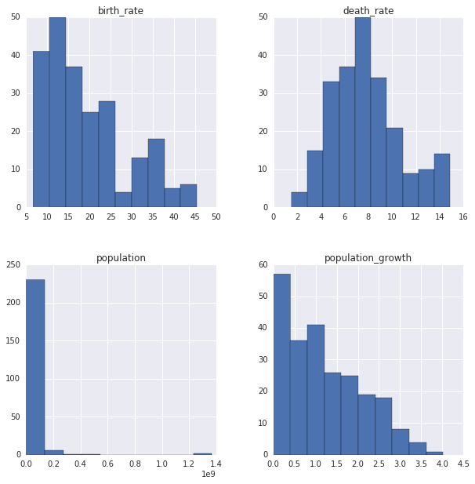
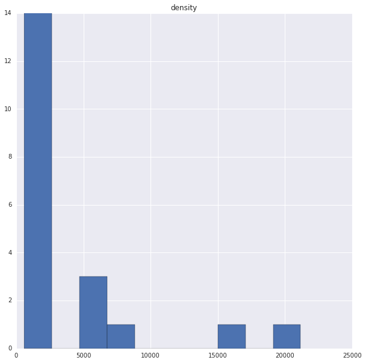

# Guided Project: Analyzing CIA Factbook Data Using SQLite and Python

In this project, we'll work with data from the CIA World Factbook, a compendium of statistics about all of the countries on Earth. The Factbook contains demographic information like:

population - The population as of 2015.
population_growth - The annual population growth rate, as a percentage.
area - The total land and water area.


```python
import pandas as pd
import sqlite3

conn = sqlite3.connect("factbook.db")
q = "SELECT * FROM sqlite_master WHERE type='table';"
pd.read_sql_query(q, conn)
```


<div>
<style scoped>
    .dataframe tbody tr th:only-of-type {
        vertical-align: middle;
    }

    .dataframe tbody tr th {
        vertical-align: top;
    }

    .dataframe thead th {
        text-align: right;
    }
</style>
<table border="1" class="dataframe">
  <thead>
    <tr style="text-align: right;">
      <th></th>
      <th>type</th>
      <th>name</th>
      <th>tbl_name</th>
      <th>rootpage</th>
      <th>sql</th>
    </tr>
  </thead>
  <tbody>
    <tr>
      <th>0</th>
      <td>table</td>
      <td>sqlite_sequence</td>
      <td>sqlite_sequence</td>
      <td>3</td>
      <td>CREATE TABLE sqlite_sequence(name,seq)</td>
    </tr>
    <tr>
      <th>1</th>
      <td>table</td>
      <td>facts</td>
      <td>facts</td>
      <td>47</td>
      <td>CREATE TABLE "facts" ("id" INTEGER PRIMARY KEY...</td>
    </tr>
  </tbody>
</table>
</div>


```python
q2 = "SELECT * FROM facts LIMIT 5"
pd.read_sql_query(q2, conn)
```


<div>
<style scoped>
    .dataframe tbody tr th:only-of-type {
        vertical-align: middle;
    }

    .dataframe tbody tr th {
        vertical-align: top;
    }

    .dataframe thead th {
        text-align: right;
    }
</style>
<table border="1" class="dataframe">
  <thead>
    <tr style="text-align: right;">
      <th></th>
      <th>id</th>
      <th>code</th>
      <th>name</th>
      <th>area</th>
      <th>area_land</th>
      <th>area_water</th>
      <th>population</th>
      <th>population_growth</th>
      <th>birth_rate</th>
      <th>death_rate</th>
      <th>migration_rate</th>
    </tr>
  </thead>
  <tbody>
    <tr>
      <th>0</th>
      <td>1</td>
      <td>af</td>
      <td>Afghanistan</td>
      <td>652230</td>
      <td>652230</td>
      <td>0</td>
      <td>32564342</td>
      <td>2.32</td>
      <td>38.57</td>
      <td>13.89</td>
      <td>1.51</td>
    </tr>
    <tr>
      <th>1</th>
      <td>2</td>
      <td>al</td>
      <td>Albania</td>
      <td>28748</td>
      <td>27398</td>
      <td>1350</td>
      <td>3029278</td>
      <td>0.30</td>
      <td>12.92</td>
      <td>6.58</td>
      <td>3.30</td>
    </tr>
    <tr>
      <th>2</th>
      <td>3</td>
      <td>ag</td>
      <td>Algeria</td>
      <td>2381741</td>
      <td>2381741</td>
      <td>0</td>
      <td>39542166</td>
      <td>1.84</td>
      <td>23.67</td>
      <td>4.31</td>
      <td>0.92</td>
    </tr>
    <tr>
      <th>3</th>
      <td>4</td>
      <td>an</td>
      <td>Andorra</td>
      <td>468</td>
      <td>468</td>
      <td>0</td>
      <td>85580</td>
      <td>0.12</td>
      <td>8.13</td>
      <td>6.96</td>
      <td>0.00</td>
    </tr>
    <tr>
      <th>4</th>
      <td>5</td>
      <td>ao</td>
      <td>Angola</td>
      <td>1246700</td>
      <td>1246700</td>
      <td>0</td>
      <td>19625353</td>
      <td>2.78</td>
      <td>38.78</td>
      <td>11.49</td>
      <td>0.46</td>
    </tr>
  </tbody>
</table>
</div>


Here are the descriptions for some of the columns:

* name - The name of the country.
* area - The total land and sea area of the country.
* population - The country's population.
* population_growth- The country's population growth as a percentage.
* birth_rate - The country's birth rate, or the number of births a year per 1,000 people.
* death_rate - The country's death rate, or the number of death a year per 1,000 people.
* area- The country's total area (both land and water).
* area_land - The country's land area in square kilometers.
* area_water - The country's waterarea in square kilometers.


#### Calculating some summary statistics to look for any outlier countries.


```python
q3 = "SELECT MIN(population) as minimum_population, MAX(population) as maximum_population, MIN(population_growth) as minimum_population_growth, MAX(population_growth) as maximum_population_growth FROM facts"
pd.read_sql_query(q3, conn)
```


<div>
<style scoped>
    .dataframe tbody tr th:only-of-type {
        vertical-align: middle;
    }

    .dataframe tbody tr th {
        vertical-align: top;
    }

    .dataframe thead th {
        text-align: right;
    }
</style>
<table border="1" class="dataframe">
  <thead>
    <tr style="text-align: right;">
      <th></th>
      <th>minimum_population</th>
      <th>maximum_population</th>
      <th>minimum_population_growth</th>
      <th>maximum_population_growth</th>
    </tr>
  </thead>
  <tbody>
    <tr>
      <th>0</th>
      <td>0</td>
      <td>7256490011</td>
      <td>0.0</td>
      <td>4.02</td>
    </tr>
  </tbody>
</table>
</div>


A few things stick out from the summary statistics in the last screen:

* there's a country with a population of 0
* there's a country with a population of 7256490011 (or more than 7.2 billion people)
Let's zoom in on just these countries:


```python
q4 = "SELECT * FROM facts WHERE population == (SELECT MAX(population) FROM facts)"
pd.read_sql_query(q4, conn)
```


<div>
<style scoped>
    .dataframe tbody tr th:only-of-type {
        vertical-align: middle;
    }

    .dataframe tbody tr th {
        vertical-align: top;
    }

    .dataframe thead th {
        text-align: right;
    }
</style>
<table border="1" class="dataframe">
  <thead>
    <tr style="text-align: right;">
      <th></th>
      <th>id</th>
      <th>code</th>
      <th>name</th>
      <th>area</th>
      <th>area_land</th>
      <th>area_water</th>
      <th>population</th>
      <th>population_growth</th>
      <th>birth_rate</th>
      <th>death_rate</th>
      <th>migration_rate</th>
    </tr>
  </thead>
  <tbody>
    <tr>
      <th>0</th>
      <td>261</td>
      <td>xx</td>
      <td>World</td>
      <td>None</td>
      <td>None</td>
      <td>None</td>
      <td>7256490011</td>
      <td>1.08</td>
      <td>18.6</td>
      <td>7.8</td>
      <td>None</td>
    </tr>
  </tbody>
</table>
</div>


From the above result, it appears that the "country" with the biggest population, is not a country, but the World.


```python
q5 = "SELECT * FROM facts WHERE population == (SELECT MIN(population) FROM facts)"
pd.read_sql_query(q5, conn)
```


<div>
<style scoped>
    .dataframe tbody tr th:only-of-type {
        vertical-align: middle;
    }

    .dataframe tbody tr th {
        vertical-align: top;
    }

    .dataframe thead th {
        text-align: right;
    }
</style>
<table border="1" class="dataframe">
  <thead>
    <tr style="text-align: right;">
      <th></th>
      <th>id</th>
      <th>code</th>
      <th>name</th>
      <th>area</th>
      <th>area_land</th>
      <th>area_water</th>
      <th>population</th>
      <th>population_growth</th>
      <th>birth_rate</th>
      <th>death_rate</th>
      <th>migration_rate</th>
    </tr>
  </thead>
  <tbody>
    <tr>
      <th>0</th>
      <td>250</td>
      <td>ay</td>
      <td>Antarctica</td>
      <td>None</td>
      <td>280000</td>
      <td>None</td>
      <td>0</td>
      <td>None</td>
      <td>None</td>
      <td>None</td>
      <td>None</td>
    </tr>
  </tbody>
</table>
</div>


The above result returns Antarctica as the counrty with no population. This makes sense, as Antarctica is not really a country in the true sense of the word.

### Generating Histograms for all but the above 2 Countries


```python
import matplotlib.pyplot as plt
import seaborn as sns
%matplotlib inline

fig = plt.figure(figsize=(10,10))
ax = fig.add_subplot(111)

q6 = "SELECT population, population_growth, birth_rate, death_rate FROM facts WHERE population NOT IN ((SELECT MAX(population) FROM facts), (SELECT MIN(population) FROM facts)) "
pd.read_sql_query(q6, conn).hist(ax=ax)


```

    /dataquest/system/env/python3/lib/python3.4/site-packages/IPython/core/interactiveshell.py:2885: UserWarning: To output multiple subplots, the figure containing the passed axes is being cleared
      exec(code_obj, self.user_global_ns, self.user_ns)


    array([[<matplotlib.axes._subplots.AxesSubplot object at 0x7f013c699278>,
            <matplotlib.axes._subplots.AxesSubplot object at 0x7f013a16eac8>],
           [<matplotlib.axes._subplots.AxesSubplot object at 0x7f013a13b278>,
            <matplotlib.axes._subplots.AxesSubplot object at 0x7f013a0f8588>]],
          dtype=object)





### Countries with the highest Population Density


```python
q7 = "select name, cast(population as float)/cast(area as float) density from facts order by density desc limit 20"
pd.read_sql_query(q7, conn)
```


<div>
<style scoped>
    .dataframe tbody tr th:only-of-type {
        vertical-align: middle;
    }

    .dataframe tbody tr th {
        vertical-align: top;
    }

    .dataframe thead th {
        text-align: right;
    }
</style>
<table border="1" class="dataframe">
  <thead>
    <tr style="text-align: right;">
      <th></th>
      <th>name</th>
      <th>density</th>
    </tr>
  </thead>
  <tbody>
    <tr>
      <th>0</th>
      <td>Macau</td>
      <td>21168.964286</td>
    </tr>
    <tr>
      <th>1</th>
      <td>Monaco</td>
      <td>15267.500000</td>
    </tr>
    <tr>
      <th>2</th>
      <td>Singapore</td>
      <td>8141.279770</td>
    </tr>
    <tr>
      <th>3</th>
      <td>Hong Kong</td>
      <td>6445.041516</td>
    </tr>
    <tr>
      <th>4</th>
      <td>Gaza Strip</td>
      <td>5191.819444</td>
    </tr>
    <tr>
      <th>5</th>
      <td>Gibraltar</td>
      <td>4876.333333</td>
    </tr>
    <tr>
      <th>6</th>
      <td>Bahrain</td>
      <td>1771.859211</td>
    </tr>
    <tr>
      <th>7</th>
      <td>Maldives</td>
      <td>1319.640940</td>
    </tr>
    <tr>
      <th>8</th>
      <td>Malta</td>
      <td>1310.015823</td>
    </tr>
    <tr>
      <th>9</th>
      <td>Bermuda</td>
      <td>1299.925926</td>
    </tr>
    <tr>
      <th>10</th>
      <td>Sint Maarten</td>
      <td>1167.323529</td>
    </tr>
    <tr>
      <th>11</th>
      <td>Bangladesh</td>
      <td>1138.069143</td>
    </tr>
    <tr>
      <th>12</th>
      <td>Guernsey</td>
      <td>847.179487</td>
    </tr>
    <tr>
      <th>13</th>
      <td>Jersey</td>
      <td>838.741379</td>
    </tr>
    <tr>
      <th>14</th>
      <td>Barbados</td>
      <td>675.823256</td>
    </tr>
    <tr>
      <th>15</th>
      <td>Mauritius</td>
      <td>656.777941</td>
    </tr>
    <tr>
      <th>16</th>
      <td>Taiwan</td>
      <td>650.781712</td>
    </tr>
    <tr>
      <th>17</th>
      <td>Aruba</td>
      <td>623.122222</td>
    </tr>
    <tr>
      <th>18</th>
      <td>Lebanon</td>
      <td>594.682788</td>
    </tr>
    <tr>
      <th>19</th>
      <td>Saint Martin</td>
      <td>588.037037</td>
    </tr>
  </tbody>
</table>
</div>


### Histograms of Population Densities


```python
import matplotlib.pyplot as plt
import seaborn as sns
%matplotlib inline

fig = plt.figure(figsize=(10,10))
ax = fig.add_subplot(111)

q8 = "select name, cast(population as float)/cast(area as float) density from facts order by density desc limit 20"
pd.read_sql_query(q8, conn).hist(ax=ax)
```


    array([<matplotlib.axes._subplots.AxesSubplot object at 0x7f0139bed7b8>],
          dtype=object)





### Counties with the highest water to land ratio


```python
q9 = '''SELECT name, 
        CAST(area_water as float) / CAST(area_land as float) water_to_land_ratio
        from facts 
        order by water_to_land_ratio desc limit 20'''

pd.read_sql_query(q9, conn)
```


<div>
<style scoped>
    .dataframe tbody tr th:only-of-type {
        vertical-align: middle;
    }

    .dataframe tbody tr th {
        vertical-align: top;
    }

    .dataframe thead th {
        text-align: right;
    }
</style>
<table border="1" class="dataframe">
  <thead>
    <tr style="text-align: right;">
      <th></th>
      <th>name</th>
      <th>water_to_land_ratio</th>
    </tr>
  </thead>
  <tbody>
    <tr>
      <th>0</th>
      <td>British Indian Ocean Territory</td>
      <td>905.666667</td>
    </tr>
    <tr>
      <th>1</th>
      <td>Virgin Islands</td>
      <td>4.520231</td>
    </tr>
    <tr>
      <th>2</th>
      <td>Puerto Rico</td>
      <td>0.554791</td>
    </tr>
    <tr>
      <th>3</th>
      <td>Bahamas, The</td>
      <td>0.386613</td>
    </tr>
    <tr>
      <th>4</th>
      <td>Guinea-Bissau</td>
      <td>0.284673</td>
    </tr>
    <tr>
      <th>5</th>
      <td>Malawi</td>
      <td>0.259396</td>
    </tr>
    <tr>
      <th>6</th>
      <td>Netherlands</td>
      <td>0.225710</td>
    </tr>
    <tr>
      <th>7</th>
      <td>Uganda</td>
      <td>0.222922</td>
    </tr>
    <tr>
      <th>8</th>
      <td>Eritrea</td>
      <td>0.164356</td>
    </tr>
    <tr>
      <th>9</th>
      <td>Liberia</td>
      <td>0.156240</td>
    </tr>
    <tr>
      <th>10</th>
      <td>Bangladesh</td>
      <td>0.140509</td>
    </tr>
    <tr>
      <th>11</th>
      <td>Gambia, The</td>
      <td>0.116601</td>
    </tr>
    <tr>
      <th>12</th>
      <td>Taiwan</td>
      <td>0.115313</td>
    </tr>
    <tr>
      <th>13</th>
      <td>Finland</td>
      <td>0.112996</td>
    </tr>
    <tr>
      <th>14</th>
      <td>India</td>
      <td>0.105634</td>
    </tr>
    <tr>
      <th>15</th>
      <td>Canada</td>
      <td>0.098000</td>
    </tr>
    <tr>
      <th>16</th>
      <td>Sweden</td>
      <td>0.097384</td>
    </tr>
    <tr>
      <th>17</th>
      <td>Colombia</td>
      <td>0.096476</td>
    </tr>
    <tr>
      <th>18</th>
      <td>Brunei</td>
      <td>0.094967</td>
    </tr>
    <tr>
      <th>19</th>
      <td>Guyana</td>
      <td>0.092050</td>
    </tr>
  </tbody>
</table>
</div>


### Countries with more water than land


```python
q10 = '''SELECT name, area_water, area_land
        FROM facts
        WHERE area_water > area_land
        ORDER BY area_water DESC
        LIMIT 20'''

pd.read_sql_query(q10, conn)
```


<div>
<style scoped>
    .dataframe tbody tr th:only-of-type {
        vertical-align: middle;
    }

    .dataframe tbody tr th {
        vertical-align: top;
    }

    .dataframe thead th {
        text-align: right;
    }
</style>
<table border="1" class="dataframe">
  <thead>
    <tr style="text-align: right;">
      <th></th>
      <th>name</th>
      <th>area_water</th>
      <th>area_land</th>
    </tr>
  </thead>
  <tbody>
    <tr>
      <th>0</th>
      <td>British Indian Ocean Territory</td>
      <td>54340</td>
      <td>60</td>
    </tr>
    <tr>
      <th>1</th>
      <td>Virgin Islands</td>
      <td>1564</td>
      <td>346</td>
    </tr>
  </tbody>
</table>
</div>


```python

```
